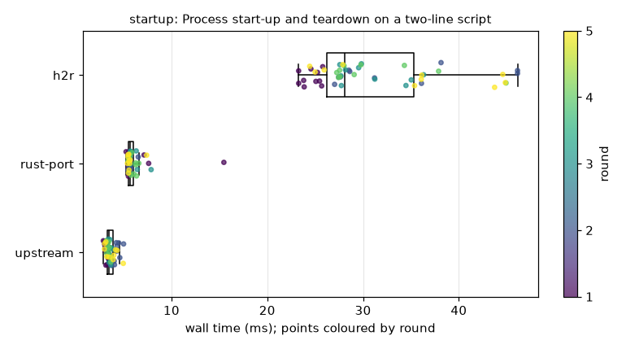
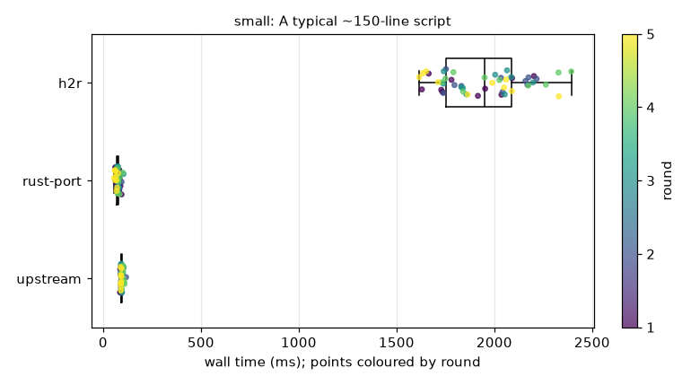
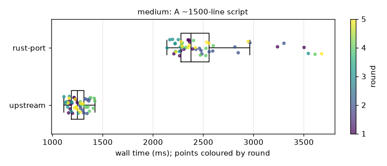
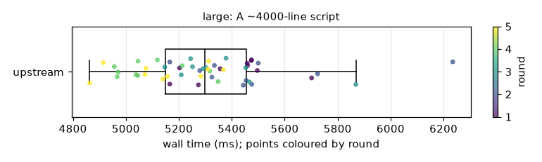
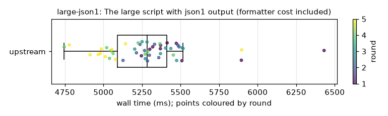
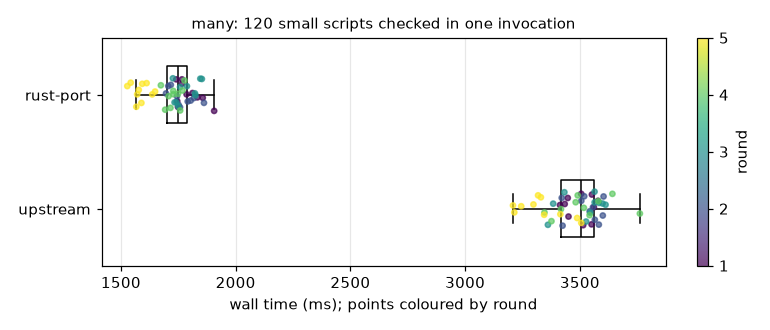

# ShellCheck benchmark — 2026-09-28

3 candidates × 6 scenarios, 5 shuffled rounds × 10 runs = **50 timed runs per cell** (+3 warm-up per round), hyperfine `-N` (no shell), not CPU-pinned. Baseline: **upstream**. Corpus `6974bbcf1fab` (seed 20260928).

## Candidates

| candidate     | what                    | pinned to      |    binary | toolchain                                                                                                                           |
| ------------- | ----------------------- | -------------- | --------: | ----------------------------------------------------------------------------------------------------------------------------------- |
| **upstream**  | koalaman GitHub release | 0.11.0         |  15.5 MiB | mise 2026.9.15 linux-x64 (2026-09-27)                                                                                               |
| **rust-port** | branch `rust-port`      | `5d3fe06964ee` |   5.3 MiB | rustc 1.98.1 (48a229cea 2026-09-01); cargo 1.98.1 (797e8a9bc 2026-08-05)                                                            |
| **h2r**       | branch `h2r-compiler`   | `1e1464790d79` | 138.3 MiB | The Glorious Glasgow Haskell Compilation System, version 9.6.7; cabal-install version 3.18.1.0; rustc 1.98.1 (48a229cea 2026-09-01) |

## Environment

- Intel(R) Xeon(R) Processor @ 2.10GHz, 4 logical CPUs, 15.7 GiB RAM, Linux-6.18.44-fc-v37-x86_64-with-glibc2.39
- hyperfine 1.20.0; load average at start 0.78, 0.93, 0.98

## Summary: speed-up relative to upstream

Speed-up = baseline mean time ÷ candidate mean time (>1 is faster), with its 95 % bootstrap interval. Bold = significant after Holm correction (adjusted Mann-Whitney p < 0.05 and interval excluding 1).

| scenario    | upstream mean |                          rust-port |                                         h2r |
| ----------- | ------------: | ---------------------------------: | ------------------------------------------: |
| startup     |       3.62 ms |      **0.60× [0.55, 0.64]** slower |               **0.12× [0.11, 0.13]** slower |
| small       |      94.78 ms |      **1.26× [1.21, 1.31]** faster |               **0.05× [0.05, 0.05]** slower |
| medium      |       1.255 s |      **0.50× [0.47, 0.52]** slower | ≈0.048× (single run: 25.956 s, over budget) |
| large       |       5.303 s | excluded (peak RSS exceeded 4 GiB) |          excluded (peak RSS exceeded 4 GiB) |
| large-json1 |       5.289 s | excluded (peak RSS exceeded 4 GiB) |          excluded (peak RSS exceeded 4 GiB) |
| many        |       3.480 s |      **2.01× [1.98, 2.04]** faster | ≈0.044× (single run: 78.620 s, over budget) |

## startup: Process start-up and teardown on a two-line script

`shellcheck -f gcc startup.sh`

| candidate |  n | mean [95 % CI]                | median [95 % CI]              | sd (CV)          |      min |      p95 | peak RSS | output vs baseline | flags                                                                                      |
| --------- | -: | ----------------------------- | ----------------------------- | ---------------- | -------: | -------: | -------: | ------------------ | ------------------------------------------------------------------------------------------ |
| upstream  | 50 | 3.62 ms [3.49 ms, 3.77 ms]    | 3.50 ms [3.39 ms, 3.66 ms]    | 0.51 ms (14.0 %) |  2.88 ms |  4.55 ms |   10 MiB | baseline           | noisy: CV 14.0%; drift between rounds: round medians spread 32% (Kruskal-Wallis p=<0.0001) |
| rust-port | 50 | 6.07 ms [5.82 ms, 6.87 ms]    | 5.68 ms [5.58 ms, 5.73 ms]    | 1.47 ms (24.3 %) |  5.26 ms |  7.52 ms |    6 MiB | identical ✓        | noisy: CV 24.3%; 5 outliers (10%)                                                          |
| h2r       | 50 | 30.97 ms [29.38 ms, 33.00 ms] | 28.09 ms [27.57 ms, 30.38 ms] | 6.62 ms (21.4 %) | 23.27 ms | 44.89 ms |   77 MiB | identical ✓        | noisy: CV 21.4%; drift between rounds: round medians spread 39% (Kruskal-Wallis p=0.0003)  |

| comparison            | speed-up (means) [95 % CI] | speed-up (medians) [95 % CI] | Mann-Whitney p (Holm) | Welch p (Holm)    | Cliff's δ     | Hedges' g | verdict                    |
| --------------------- | -------------------------- | ---------------------------- | --------------------- | ----------------- | ------------- | --------: | -------------------------- |
| rust-port vs upstream | 0.60× [0.55, 0.64]         | 0.62× [0.60, 0.64]           | <0.0001 (<0.0001)     | <0.0001 (<0.0001) | +1.00 (large) |     +2.20 | **slower**: 68% more time  |
| h2r vs upstream       | 0.12× [0.11, 0.13]         | 0.12× [0.11, 0.13]           | <0.0001 (<0.0001)     | <0.0001 (<0.0001) | +1.00 (large) |     +5.78 | **slower**: 756% more time |
| rust-port vs h2r      | 5.10× [4.63, 5.54]         | 4.95× [4.84, 5.35]           | <0.0001 (<0.0001)     | <0.0001 (<0.0001) | -1.00 (large) |     -5.15 | **faster**: 80% less time  |

## small: A typical ~150-line script

`shellcheck -f gcc small.sh`

| candidate |  n | mean [95 % CI]                | median [95 % CI]              | sd (CV)            |      min |       p95 | peak RSS | output vs baseline | flags                                                                                      |
| --------- | -: | ----------------------------- | ----------------------------- | ------------------ | -------: | --------: | -------: | ------------------ | ------------------------------------------------------------------------------------------ |
| upstream  | 50 | 94.78 ms [93.39 ms, 96.77 ms] | 93.48 ms [91.79 ms, 94.04 ms] | 6.03 ms (6.4 %)    | 87.23 ms | 106.73 ms |   42 MiB | baseline           | 7 outliers (14%); drift between rounds: round medians spread 11% (Kruskal-Wallis p=0.0004) |
| rust-port | 50 | 75.22 ms [72.71 ms, 78.20 ms] | 73.83 ms [72.23 ms, 76.61 ms] | 9.99 ms (13.3 %)   | 56.17 ms |  94.45 ms |   42 MiB | identical ✓        | noisy: CV 13.3%; drift between rounds: round medians spread 18% (Kruskal-Wallis p=0.0032)  |
| h2r       | 50 | 1.946 s [1.891 s, 2.005 s]    | 1.952 s [1.832 s, 2.042 s]    | 209.41 ms (10.8 %) |  1.616 s |   2.299 s |  164 MiB | identical ✓        | noisy: CV 10.8%                                                                            |

| comparison            | speed-up (means) [95 % CI] | speed-up (medians) [95 % CI] | Mann-Whitney p (Holm) | Welch p (Holm)    | Cliff's δ     | Hedges' g | verdict                     |
| --------------------- | -------------------------- | ---------------------------- | --------------------- | ----------------- | ------------- | --------: | --------------------------- |
| rust-port vs upstream | 1.26× [1.21, 1.31]         | 1.27× [1.21, 1.29]           | <0.0001 (<0.0001)     | <0.0001 (<0.0001) | -0.87 (large) |     -2.35 | **faster**: 21% less time   |
| h2r vs upstream       | 0.05× [0.05, 0.05]         | 0.05× [0.05, 0.05]           | <0.0001 (<0.0001)     | <0.0001 (<0.0001) | +1.00 (large) |    +12.40 | **slower**: 1953% more time |
| rust-port vs h2r      | 25.87× [24.68, 27.12]      | 26.44× [24.36, 27.88]        | <0.0001 (<0.0001)     | <0.0001 (<0.0001) | -1.00 (large) |    -12.52 | **faster**: 96% less time   |

## medium: A ~1500-line script

`shellcheck -f gcc medium.sh`

| candidate |  n | mean [95 % CI]                                     | median [95 % CI]           | sd (CV)            |     min |     p95 | peak RSS | output vs baseline | flags                                                                                                       |
| --------- | -: | -------------------------------------------------- | -------------------------- | ------------------ | ------: | ------: | -------: | ------------------ | ----------------------------------------------------------------------------------------------------------- |
| upstream  | 50 | 1.255 s [1.233 s, 1.278 s]                         | 1.249 s [1.215 s, 1.280 s] | 82.32 ms (6.6 %)   | 1.114 s | 1.394 s |  248 MiB | baseline           | drift between rounds: round medians spread 16% (Kruskal-Wallis p=<0.0001)                                   |
| rust-port | 50 | 2.534 s [2.441 s, 2.668 s]                         | 2.379 s [2.302 s, 2.478 s] | 402.66 ms (15.9 %) | 2.140 s | 3.526 s | 1374 MiB | identical ✓        | noisy: CV 15.9%; 6 outliers (12%); drift between rounds: round medians spread 15% (Kruskal-Wallis p=0.0010) |
| h2r       |  1 | 25.956 s (single pre-check run, not in the rounds) |                            |                    |         |         | 1354 MiB | identical ✓        | over the 15 s per-run budget                                                                                |

| comparison            | speed-up (means) [95 % CI] | speed-up (medians) [95 % CI] | Mann-Whitney p (Holm) | Welch p (Holm)    | Cliff's δ     | Hedges' g | verdict                    |
| --------------------- | -------------------------- | ---------------------------- | --------------------- | ----------------- | ------------- | --------: | -------------------------- |
| rust-port vs upstream | 0.50× [0.47, 0.52]         | 0.52× [0.50, 0.55]           | <0.0001 (<0.0001)     | <0.0001 (<0.0001) | +1.00 (large) |     +4.37 | **slower**: 102% more time |

## large: A ~4000-line script

`shellcheck -f gcc large.sh`

| candidate |  n | mean [95 % CI]                    | median [95 % CI]           | sd (CV)           |     min |     p95 | peak RSS | output vs baseline | flags                                                                   |
| --------- | -: | --------------------------------- | -------------------------- | ----------------- | ------: | ------: | -------: | ------------------ | ----------------------------------------------------------------------- |
| upstream  | 50 | 5.303 s [5.241 s, 5.380 s]        | 5.297 s [5.212 s, 5.348 s] | 248.24 ms (4.7 %) | 4.863 s | 5.714 s | 1194 MiB | baseline           | drift between rounds: round medians spread 8% (Kruskal-Wallis p=0.0002) |
| rust-port |  0 | excluded: peak RSS exceeded 4 GiB |                            |                   |         |         | 4098 MiB | unknown            |                                                                         |
| h2r       |  0 | excluded: peak RSS exceeded 4 GiB |                            |                   |         |         | 4099 MiB | unknown            |                                                                         |

## large-json1: The large script with json1 output (formatter cost included)

`shellcheck -f json1 large.sh`

| candidate |  n | mean [95 % CI]                    | median [95 % CI]           | sd (CV)           |     min |     p95 | peak RSS | output vs baseline | flags                                                                                    |
| --------- | -: | --------------------------------- | -------------------------- | ----------------- | ------: | ------: | -------: | ------------------ | ---------------------------------------------------------------------------------------- |
| upstream  | 50 | 5.289 s [5.221 s, 5.378 s]        | 5.284 s [5.237 s, 5.363 s] | 283.05 ms (5.4 %) | 4.746 s | 5.724 s | 1194 MiB | baseline           | 3 outliers (6%); drift between rounds: round medians spread 7% (Kruskal-Wallis p=0.0003) |
| rust-port |  0 | excluded: peak RSS exceeded 4 GiB |                            |                   |         |         | 4098 MiB | unknown            |                                                                                          |
| h2r       |  0 | excluded: peak RSS exceeded 4 GiB |                            |                   |         |         | 4100 MiB | unknown            |                                                                                          |

## many: 120 small scripts checked in one invocation

`shellcheck -f gcc many/000.sh many/001.sh many/002.sh many/003.sh …` (120 files)

| candidate |  n | mean [95 % CI]                                     | median [95 % CI]           | sd (CV)           |     min |     p95 | peak RSS | output vs baseline | flags                                                                     |
| --------- | -: | -------------------------------------------------- | -------------------------- | ----------------- | ------: | ------: | -------: | ------------------ | ------------------------------------------------------------------------- |
| upstream  | 50 | 3.480 s [3.447 s, 3.511 s]                         | 3.506 s [3.447 s, 3.544 s] | 115.20 ms (3.3 %) | 3.209 s | 3.608 s |   28 MiB | baseline           | drift between rounds: round medians spread 7% (Kruskal-Wallis p=0.0014)   |
| rust-port | 50 | 1.732 s [1.706 s, 1.755 s]                         | 1.747 s [1.728 s, 1.762 s] | 88.98 ms (5.1 %)  | 1.528 s | 1.855 s |   28 MiB | identical ✓        | drift between rounds: round medians spread 11% (Kruskal-Wallis p=<0.0001) |
| h2r       |  1 | 78.620 s (single pre-check run, not in the rounds) |                            |                   |         |         |  174 MiB | identical ✓        | over the 15 s per-run budget                                              |

| comparison            | speed-up (means) [95 % CI] | speed-up (medians) [95 % CI] | Mann-Whitney p (Holm) | Welch p (Holm)    | Cliff's δ     | Hedges' g | verdict                   |
| --------------------- | -------------------------- | ---------------------------- | --------------------- | ----------------- | ------------- | --------: | ------------------------- |
| rust-port vs upstream | 2.01× [1.98, 2.04]         | 2.01× [1.97, 2.04]           | <0.0001 (<0.0001)     | <0.0001 (<0.0001) | -1.00 (large) |    -16.85 | **faster**: 50% less time |

## How to read this

- **Design.** Every candidate runs the identical argument list on the identical files from the same directory. Order is re-shuffled each round so slow machine drift is shared out; the per-round data is kept and a Kruskal-Wallis test across rounds (with the round medians more than 5 % apart) flags drift. hyperfine `-N` launches the process directly, so no shell start-up is inside the measurement; `--output null` discards stdout the same way for everyone.
- **Intervals** are bias-corrected accelerated (BCa) bootstrap intervals from 10,000 resamples for means and medians, and percentile-bootstrap intervals for the ratios (the two samples are resampled independently). If a speed-up interval includes 1, the data does not distinguish the two.
- **Tests.** Mann-Whitney U is the primary test: timing distributions are skewed and it makes no normality assumption. Welch's t-test is shown for comparison. Both are Holm-adjusted across every comparison in this report, so with many scenarios the family-wise false-positive rate stays at 5 %.
- **Effect size.** Cliff's δ is the probability a random run of the first is slower than a random run of the second, minus the reverse (±1 = complete separation); Hedges' g is the standardised mean difference. A significant p with a negligible δ is a real but tiny difference.
- **Pre-check.** Before timing, each candidate ran each scenario once under a 4 GiB peak-RSS cap and a 600 s timeout. A crash, hang or blown cap excludes it from that scenario. Output is compared with the baseline's (JSON compared structurally); a difference does not exclude, but it does void the comparison: a faster program computing something else is not a faster ShellCheck.
- **Budget.** A candidate whose pre-check run took longer than 15 s is not sampled in the rounds (fifty runs of a minute each is not a benchmark, it is a wait); that single run is reported instead, marked as such, and the ratio next to it is a rough single-run figure with no interval. Raise `--max-run-seconds` for a dedicated slow run.
- **Peak RSS** is hyperfine's per-run maximum resident set size (median over runs).

Raw samples: `run.json` (not committed; regenerate with `mise run bench`); every number here: `summary.json`; per-round hyperfine exports: `raw/`; pre-check outputs and diffs: `precheck/`.
