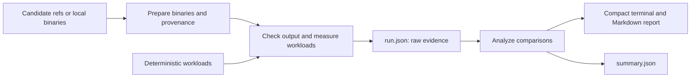

# ShellCheck benchmark project: design

Status: implemented contract. Cold h2r build duration and hosted cache performance remain to be measured.

## Requirements

Compare upstream ShellCheck with both the handwritten Rust port and the GHC Core to Rust implementation. Produce trustworthy, concise measurements that identify correctness, runtime, memory, startup, scaling, and batch-processing problems. Make the benchmark branch a coherent project with a clear entry point, predictable layout, and reproducible runs.

Keep local iteration practical. Measuring a locally modified candidate must be possible without fetching or replacing its checkout. Existing staged changes and the dirty nested h2r checkout must survive implementation.

## Layout

```text
README.md                    purpose, setup, one example, how to read results
pyproject.toml               one Python package and bench entry point
mise.toml                    tool versions and build task adapters
src/bench/
  cli.py                     prepare, run, report commands
  candidates.py              candidate identity and prepared binary manifests
  corpus.py                  repeatable workloads
  measure.py                 parity checks, guards, shuffled measurements
  analyze.py                 statistics and decision rules
  report.py                  compact Markdown summary
  plots.py                   optional timing plots
  schema.py                  shared artifact contracts
  candidates.toml            defaults for the three implementations
  scenarios.toml             workload definitions
  corpora.toml               pinned real-world source identities
  omarchy.py                 checked import of the Omarchy shell corpus
tests/                       substantive measurement and report checks
results/                     deliberately archived runs
.bench/                      ignored checkouts, builds, generated workloads/runs
```

Use the same commands locally and in CI. Entry point: `uv run bench`, with `prepare`, `run`, and `report` subcommands. A default run composes those stages; an explicit prepared binary skips building it. Tool setup and candidate builds remain visible tasks in mise. Dependencies used only by optional plots belong in an optional dependency group.



## Metric contract

For each scenario and candidate show correctness status, median elapsed time, runtime relative to upstream with a confidence interval, peak RSS with its ratio to upstream, and measurement status. Define ratios once: candidate divided by upstream, so higher values always mean more cost. Keep baseline measurements visible.

The first screen should answer: where does each implementation produce different output, where does it spend more time or memory, and which measurements need repeating? Summarize the largest reliable cost differences before detailed rows. Show links to output diffs and raw samples. Diagnose mechanisms such as algorithmic complexity only when measurements or profiling support them.

Startup, small/medium/large scripts, JSON output, and many-file batches retain distinct purposes. Include representative real scripts when redistributable and versioned. Generated workloads provide controlled scaling probes; do not imply they represent every real script.

Omarchy is a structural CI workload, pinned by full commit SHA independently of candidate builds. Import all tracked regular files with a shell extension or shell shebang, including non-executable installation fragments. Include extensionless Bash setup files and sourced UWSM, mkinitcpio, and Limine configuration through explicit patterns recorded in `corpora.toml`; exclude Readline configuration. Preserve bytes, record checksums and provenance in the corpus and run manifests, and expand scenario globs only against that recorded inventory. Commands, installation scripts, migrations, tests, and remaining shell files form disjoint groups; the largest command and complete GCC/JSON batches provide additional views. Run from the snapshot root so relative source paths retain their context. Never execute Omarchy's scripts.

Each scenario records its sampling budget: 15 seconds for generated fixtures and 60 seconds for Omarchy. An explicit CLI budget overrides both. Initial output/RSS sweeps have a separate hard timeout of 20 minutes for real source workloads, or 10 minutes for synthetic-only runs; an explicit CLI timeout overrides it. Pre-checks use the sampling budget to admit candidates to repeated sampling; timed rounds use it multiplied by their execution count, plus a small overhead allowance. Reuse candidate binaries across both datasets and cache the pinned source separately; fetching or changing the corpus must not trigger h2r compilation.

Routine CI explicitly overrides sampling to four rounds of five timed runs, one warm-up per round, and a two-second admission budget for every workload. Keep upstream and rust-port's complete initial checks and GCC/JSON sweeps; report expensive completed pairs as single observations. This preserves twenty samples and multiple shuffled rounds for inexpensive comparisons without repeating minute-long whole-corpus baselines fifty times. Workflow inputs retain an opt-in extended sampling run, while h2r's total measurement cap remains 600 seconds.

Charge h2r's actual command elapsed time to a shared 600-second allowance across initial checks and repeated batches, including warm-ups and process cleanup. Execute its complete Omarchy GCC sweep first. Limit each process to the remaining allowance, terminate its process group on expiry, and skip subsequent work. Record the configured budget and consumed time in run.json and the report. Mark interrupted checks as budget-limited with unknown parity, and unexecuted checks as skipped; neither earns a comparison or winner. A stopped full sweep means incomplete coverage. Waiting for other candidates, compilation and cache restoration do not consume h2r's measurement allowance. Based on previous CI timings, expect about 17 minutes of measurement overall with cached binaries, plus setup and runner variation.

Keep shuffled repeated measurements and uncertainty estimates. Preserve output parity checks and bounded execution. Mark mismatches, noisy runs, timeouts, memory limits, and single-run observations explicitly. Mismatched output does not earn a speed verdict. Historical results remain historical, including the original limits and candidate commits.

A timed batch can exceed its execution budget even after an initial sweep passed admission. Stop further repeats for that candidate and workload, retain any completed rounds and incomplete export, and continue the rest of the benchmark. Record the stop reason separately from the initial pre-check. Report the initial sweep as one observation; omit statistics and comparisons for the interrupted series.

## Decisions

### ADR-001: Keep this branch a complete benchmark project

Decision: make the root documentation, package name, configs, commands, and generated-data locations agree with the benchmark purpose. Remove obsolete upstream packaging references when implementing, after reviewing existing edits.

Alternative: retain the upstream project presentation and bolt benchmarking onto it. This leaves misleading documentation and configuration. A standalone project requires deliberate maintenance of its own short README and dependencies.

### ADR-002: Separate preparation from measurement through a manifest

Decision: prepare each binary once and record its path, checksum, version, exact source identity when known, and dirty state for local sources. Resolve requested refs to exact commits before building. The runner consumes this manifest and does not infer a build plan from Cargo's private install record.

Alternative: let the runner discover and build candidates implicitly. This reduces explicit plumbing but mixes source resolution, build lifecycle, and measurement. Manifest preparation introduces one small artifact contract and enables arbitrary binaries and dirty local checkouts.

### ADR-003: Use one immutable measurement artifact

Decision: `run.json` is the reproducible evidence for a run; reports and summaries derive from it. Store the necessary parity evidence and samples alongside it. Seed statistical resampling. Rendering must not rebuild candidates or alter measurements.

Alternative: reconstruct runs from multiple undocumented files. This makes archived reports harder to verify. A versioned artifact needs explicit compatibility handling; preserve old reports without pretending missing raw data can be reconstructed.

### ADR-004: Retain rigorous analysis behind a compact report

Decision: preserve the checks and statistics required for reliable conclusions; make a small comparison table and supported priorities the default output. Keep detailed statistics and optional plots available separately.

Alternative: print every statistical result or reduce measurements to one timing. The former overwhelms interpretation; the latter hides uncertainty. Compact reporting requires explicit rules for evidence quality and comparability.

### ADR-005: Treat h2r preparation as an expensive persistent build

Decision: model the multi-hour cold h2r build explicitly. Cache the completed binary and its provenance under an exact identity comprising source revision (or local content identity), OS/architecture, pinned toolchain, lockfiles, build profile, flags, and preparation recipe version. A validated binary cache hit skips compilation entirely. Use the candidate lockfile for each tool and the harness lockfile for missing tool entries. Prepared binaries use content-addressed paths so earlier runs continue to reference their original executable. Benchmark configuration, report formatting, and statistical changes do not invalidate candidate builds.

Maintain a second cache for compatible intermediate build state: Cargo artifacts and fingerprints, the h2r layers located by `layer::claim`, Cabal build state and store, package index, and dependency downloads. Use persistent checkout and build paths so source-path churn does not unnecessarily invalidate artifacts. A new source revision may restore compatible preceding state; the compiler's input fingerprints and build system determine what can actually be reused. Never publish an older finished binary as the new revision. Cache capacity, eviction, path portability, and changed fingerprints can still force expensive rebuilds.

Separate CI preparation jobs from the measurement job. Preparation produces immutable binary artifacts plus manifests; the measurement job runs all candidates on one machine after preparation completes. Local measurement consumes prepared binaries directly. Run and report commands never compile; the convenience command explicitly shows preparation before beginning it. Changing workloads or repeating measurements reuses the prepared binaries.

Resolve each requested ref once, then build that exact revision. Serialize concurrent writes to a mutable build directory. Publish completed binary cache entries only after successful preparation and provenance verification. Preserve reusable intermediate state after a failed or timed-out build when the job can safely finish its cache step; never treat that state as a completed build. Keep dependency caches independently useful when a particular candidate build fails. Do not cancel a multi-hour preparation merely because a benchmark report or workload changed.

Preparation status should show binary hit, incremental build, or cold build, together with duration. Verify the promised behavior with a cold build, same-identity reuse, a source change, a build-input change, and workload/report-only changes. Same-identity reuse must execute no compiler; incremental performance must be measured before claiming a speedup.

Alternative: rebuild within each measurement job or maintain only completed-binary caches. The former makes routine benchmarking expensive; the latter makes every source revision risk a cold rebuild. Separate preparation adds CI artifact transfer and cache-management work, but keeps this cost outside the measurement lifecycle.

## Implementation considerations

The initial index and worktree represented different build strategies and documentation/archive layouts. The implementation changes the working files while preserving the staged index. The nested `ports/h2r` repository contains eleven modified files; preserve those changes and treat compiler repairs as a separate concern from benchmark architecture.

CI should invoke the same stages as local use, with caching around preparation. Keys must include exact source and relevant tool/build inputs. Resolve refs once so cached provenance and measured binaries cannot disagree. GNU time measures pre-check RSS without inheriting the Python parent footprint, and a watchdog bounds elapsed time and process-tree memory. Keep timeout and memory limits explicit; failed candidates should remain visible in reports. Capture only environment details needed to reproduce measurements, never credentials or the full environment.

The implementation retains the existing runtime and benchmark engine. The existing Python tooling and hyperfine can support it. The runner accepts both hyperfine 1.x and 2.x export contracts, with explicit unit validation for 2.x metrics.
